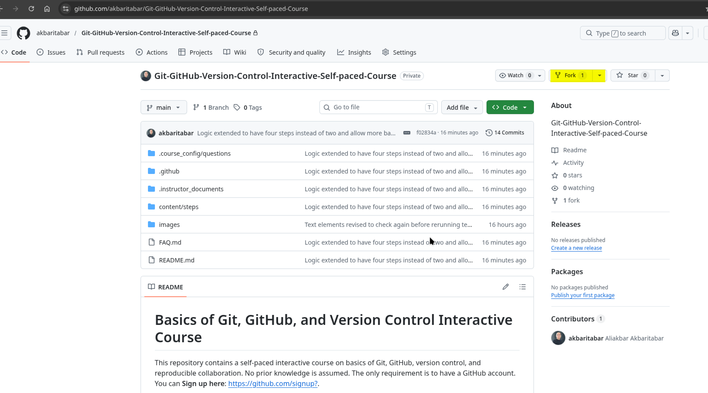
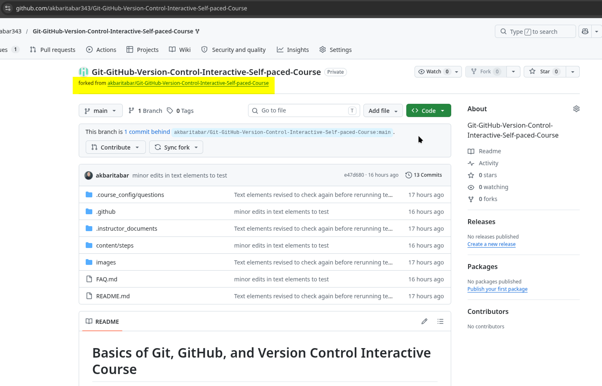
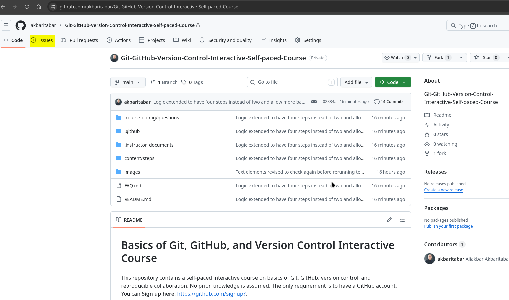

# Interactive Course on Basics of Git, GitHub, and Version Control

This repository contains a self-paced interactive course on basics of Git, GitHub, version control, and reproducible collaboration. No prior knowledge is assumed. The only requirement is to have a GitHub account. You can **Sign up here**: [https://github.com/signup?](https://github.com/signup?).

Once you have created your GitHub account, you can participate in the course following the guidelines in **[How to participate](#how-to-participate)**.

## Credits and acknowledgements

The course's automated workflow is adapted from the `repro-collab` repository by Aaron Peikert et al. 2025, available in [https://github.com/aaronpeikert/repro-collab](https://github.com/aaronpeikert/repro-collab).

Since Aaron's course was, in my opinion, a bit advanced for a basic introduction, I revised the content substantially. The content here comes from my previous course on basics of Git, GitHub, and version control. The 2025 edition could be accessed here: [https://github.com/akbaritabar/Using-Git-and-GitHub-for-Open-Science-Workshop](https://github.com/akbaritabar/Using-Git-and-GitHub-for-Open-Science-Workshop). Here, I have modified the content to fit the context, i.e., learning about Git, GitHub and version control via an interactive course hosted *inside* GitHub issues. At the end of the course, you will have the possibility provide feedback and let me know if you find it helpful or something could be improved. Looking forward to reading your feedback.

In adapting the automated workflow to use it for my content I used multiple prompts and follow-up iterations with Claude Sonnet 4.6 and GPT 5.3 Codex to resolve issues. I have read and reviewed all lines of the GitHub workflow generated, ran multiple tests with different accounts to check everything from the instructor's and the student's perspective. I take full responsibility for the content and workflow of this interactive course. 

The course is publicly released under a `GNU GPL 3.0 license`, please feel free to use it to edit and teach Git, GitHub and version control (some instructions on how to set up the repository is provided under ".instructor_documents"). Opening issues with problems you faced is highly encouraged and appreciated.

## TODO before the course

You need to have a `GitHub` account to follow the Hands-on interactive course. **Sign up here**: [https://github.com/signup?](https://github.com/signup?)

## How to participate

### 1) Fork this repository

Look for the **Fork** button near the top right of this page and click it (photo below, look for the *yellow highlight*).

GitHub will ask you to confirm where to fork. Select your own GitHub account and click **Create fork**. You will be taken to your fork — a copy of this repository now living under your own GitHub account.

### 2) Navigate back to the instructor's repository

After forking you are looking at **your fork**. Just below the repository name, GitHub shows a small line that reads:

> forked from **instructor/repository-name**

Click that link to go back to the instructor's original repository (photo below, look for the *yellow highlight*).

### 3) Find your course tracking issue

In the instructor's repository, click the **Issues** tab at the top of the page (photo below, look for the *yellow highlight*).

Look for an issue whose title starts with your GitHub username, for example:

> **@your-username started the Git/GitHub interactive course**

Make sure the username in the title matches **your own** — each participant has their own separate issue. Open it and follow the instructions posted there.

### 4) Answer questions and advance through the steps

The tracking issue is where the course advances. When a step asks you to answer a question, reply by adding a **comment** in the tracking issue. When you are ready to be checked, include `/done 1` (or `/done 2`, `/done 3`, `/done 4`) in your comment. Your written answer and the `/done N` command can be in the same comment or in two separate ones.

The automated workflow will reply with feedback. If your answer covers the required ideas, the next step will be posted as a new comment automatically. If your answer does not suffice, you will receive a new reply with further guidelines on how to retry.

### 5) Optional, but highly recommended: receive a personal archive of the teaching materials in your fork

As you complete each step, the course can save a copy of the teaching materials to an issue in your own fork. To enable this, follow the instructions in the first comment of your tracking issue (in instructor's repository, see step 3 above) — it explains how to activate Issues in your fork settings. This is optional; your course progress is not affected if you skip it, but we highly recommend it as you can later refer to these materials on your own GitHub fork.

## What the current version covers

- Step 1 introduces version control, Git, why it matters, terminal basics, essential Git commands, and `.gitignore`.
- Step 2 introduces GitHub, repositories, forking, cloning, remote commands (`pull`, `push`, `clone`, `remote -v`), and syncing forks.
- Step 3 introduces branches, collaborative workflows, plain text for research, and connections to open science and reproducibility.
- Step 4 introduces advanced tools: Git in editors (VS Code, RStudio), Git aliases, GitHub Pages, GitHub Actions, workflow managers (SnakeMake, Targets), reproducible environments (`renv`, `uv`, Docker), and research archiving (OSF, Zenodo).

## Repository structure

- `content/steps/` contains the lesson text for steps 1–4.
- `images/` contains images that can be embedded in lesson markdown.
- `.github/workflows/` contains the automation process.
- `.github/scripts/` contains the routing and validation logic.
- `.instructor_documents/` contains instructor and maintenance documentation for those who wish to teach using these materials.
- `FAQ.md` includes Frequently Asked Questions/problems.

## Private testing note

This course can be tested in a private repository if private forking is allowed and collaborators have access to the upstream repository. For maintainer caveats and settings, see the instructor documentation in `.instructor_documents/`.

## Troubleshooting

If you run into problems — your personal archive is not updating, a step appears stuck, or you need to start over — see the [Frequently Asked Questions](FAQ.md) for step-by-step solutions.
